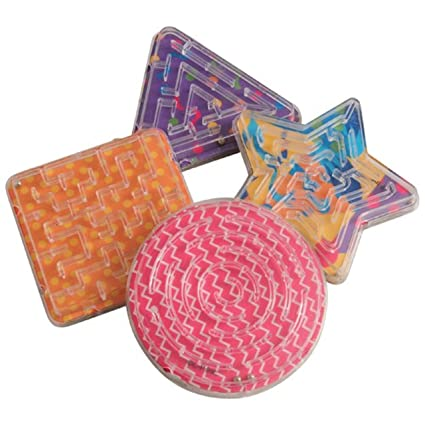

# AR-Labirinth-Android
 2020/2 - 2021/1 szakdolgozat - Csáki Gergő

## Leírás
AR Labirintus játék Android platformra Unity segítségével. A program céla a régi kisméretű kézi labirintus játékok rekreálása AR környezetben. A mobiltelefon kamerájával rámutatunk egy Target képre amelyre rávetítjük a labirintust, majd a kép, névjegykártya mozgatásával, és döntésével a valós játékot imitálva kell eljuttatni a golyókat a kijelölt helyükre megadott időkorláton belül.

Valós referencia:

 

## Alkalmazás elemei
* Labirintus játék több golyóval, és megadott teljesítési határidővel
* Pálya választó feltüntetett legjobb időkkel
* Beállítások, és Leírás menüpont

## Telepítés
 A játék használatához szükséges egy [ARCore](https://developers.google.com/ar/discover/supported-devices) kompatibilis eszköz, illetve engedélyezni kell az ismeretlen forrásból származó alkalmazások telepítését.
 Az .apk elérhető itt: [Letöltés](https://github.com/Csaki95/AR-Labirinth-2019-Android/raw/master/Builds/AR%20Labirinth.apk)
 
 ## Fejlesztés
 A játék Unity 2020.1.10f verzióban készül ARCore 1.20.0-ra építve.
 
 Jelenlegi teszt eszközök:
 * Samsung Galaxy A71
 * Xiaomi Redmi Note 8
 
 ## Targetek
 
 Az elsődleges target kép a következő tengerpart fotó. A névjegykártya target része is erre lesz építve letöltéshez kattintson a képre.
 
 
 
 Továbbra is használható viszont a referencia kép, amely valamivel jobban működik gyenge fényforrásoknál is.
 
 
 
