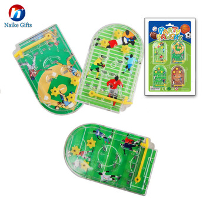
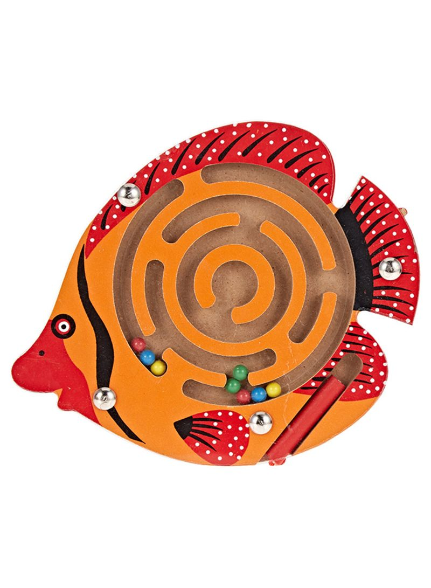

# AR-Labirinth-2019-Android
 2020/2 szakdolgozat - Csáki Gergő

## Leírás
AR Labirintus játék Android platformra Unity segítségével. A program céla a régi kisméretű kézi labirintus játékok rekreálása AR környezetben. A mobiltelefon kamerájával rámutatunk egy Target képre amelyre rávetítjük a labirintust, majd a kép, névjegykártya, vagy klubkártya mozgatásával, és döntésével a valós játékot imitálva kell eljuttatni a golyókat a kijelölt helyükre.

Valós referenciák:

 
 
 

## Telepítés
 A játék használatához szükséges egy [ARCore](https://developers.google.com/ar/discover/supported-devices) kompatibilis eszköz, illetve engedélyezni kell az ismeretlen forrásból származó alkalmazások telepítését.
 Az .apk elérhető itt: [Letöltés](https://github.com/Csaki95/AR-Labirinth-2019-Android/raw/master/Builds/AR%20Labirinth.apk)
 
 ## Fejlesztés
 A játék Unity 2020.1.10f verzióban készül ARCore 1.20.0-ra építve.
 
 Jelenlegi teszt eszközök:
 * Huawei P Smart Z
 * Xiaomi Redmi Note 8
 
 ## Targetek
 
 A tesztelés folytatásához ezek után nem alkalmasak gyenge követhetőségű target-ek, így pillanatnyilag csak a hivatalos referencia kép működik.
 
 
 
